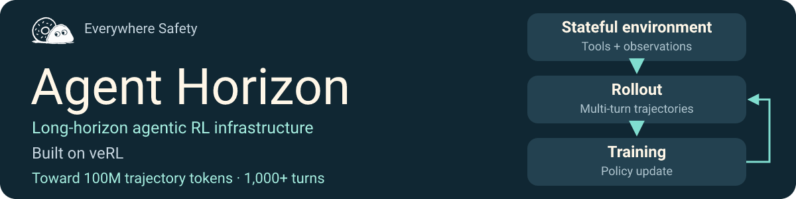
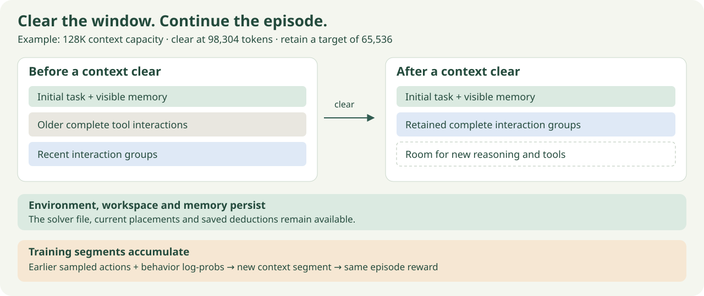
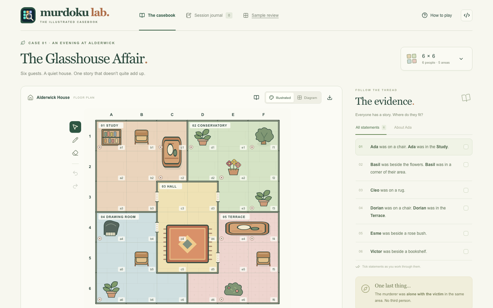

<div align="center">



# Agent Horizon

[Website](https://everywheresafety.github.io/agent-horizon/) · [How it works](#how-it-works) · [Get started](#get-started) · [Murdoku demo](#demo-murdoku-lab) · [Docs](docs/README.md)

</div>

**Long-horizon agentic RL infrastructure built on [veRL](https://github.com/verl-project/verl).**
Train agents whose episodes continue across context windows, with persistent task
state, tools and memory. Keep the veRL training stack and configure the objective,
model and distributed execution for your workload.

## What Agent Horizon adds

- **Episodes beyond the context window.** Clear old interactions while keeping
  the task, environment and memory alive. Set context capacity, assistant turns
  and cumulative generation budgets independently.
- **Training across context changes.** Preserve sampled actions and behavior
  log-probabilities as segments, with rewards associated with the parent episode.
- **A task interface.** Connect queries, executable dynamics, tools and rewards
  through self-contained records or an installed environment plugin.
- **Episode continuity.** Snapshot and restore context, environment, memory and
  rollout progress at consistent boundaries.

The scaling direction is **100M trajectory tokens and 1,000+ turns** through
successive context segments.

## How it works

An agent may write a solver, inspect its output, save a deduction and continue
working after its old conversation is cleared. **The conversation window changes;
the task and its training history continue.**



Agent Horizon connects this episode lifecycle to veRL's rollout and actor-training
components. Asynchronous execution uses veRL `separate_async`; the integration
carries episode segments, rewards and policy-version metadata through that path.


| You provide | Agent Horizon manages | Configure through veRL |
| --- | --- | --- |
| Initial query and tool schemas | Multi-turn execution and context transitions | Model, rollout engine and parallelism |
| Task state and executable tools | Persistent memory, workspace and recovery | Actor optimization, batching and precision |
| Reward function | Episode-linked training segments | Training objective and distributed execution |

Use the included training profiles or register a
[trainer extension](docs/reference/trainer-plugins.md). Algorithm choice is a
configuration of the training stack.

## Get started

Prepare the Linux GPU runtime, then supply a model checkpoint and task records:

```bash
git clone https://github.com/EverywhereSafety/agent-horizon.git
cd agent-horizon
python3 -m pip install uv
bash scripts/bootstrap.sh
source .venv/bin/activate

python scripts/prepare_queries.py train.jsonl --output outputs/data/train.parquet
python scripts/prepare_queries.py validation.jsonl --output outputs/data/val.parquet
export LONG_HORIZON_TRAIN_FILE="$PWD/outputs/data/train.parquet"
export LONG_HORIZON_VAL_FILE="$PWD/outputs/data/val.parquet"
export LONG_HORIZON_MODEL_PATH=/absolute/path/to/model
bash scripts/train_long_horizon.sh
```

Start from the complete [query-with-dynamics example](examples/dynamic_counter.jsonl),
or follow the [environment contract](docs/guides/environments.md) to connect your
own task. [Runtime setup](docs/reference/runtime-checks.md) covers dependencies and
qualification; [backend compatibility](docs/reference/architecture.md#backend-compatibility)
describes the current model adapter.

Configure episode limits in [agent_long_horizon.yaml](configs/agent_long_horizon.yaml):

```yaml
max_context_tokens: 131072
clear_trigger_tokens: 98304
clear_target_tokens: 65536
max_turns: 1000
max_generated_tokens: null
```

These fields are under `episode_config`. Set the serving backend's `max_model_len`
to the same context capacity. Training and resource settings remain launcher
configuration overrides.

## Demo: Murdoku Lab

[Explore the demo](https://everywheresafety.github.io/murdoku/) ·
[Game and generator](https://github.com/EverywhereSafety/murdoku-lab) ·
[Blog](https://everywheresafety.github.io/blog/murdoku-as-vhd/)

A detective puzzle becomes an interactive training task: inspect the board,
reason with tools, place the characters and submit the arrangement and murderer.
The verified puzzle supplies the gold reward.



Murdoku Lab supplies the queries, puzzle dynamics, tools and grader. Agent Horizon
supplies the episode and training integration. The
[demo branch](https://github.com/EverywhereSafety/agent-horizon/tree/refactor/murdoku-demo/examples/murdoku)
contains the bridge and setup commands; the core framework remains task-independent.

## Documentation

[Environment interface](docs/guides/environments.md) ·
[Context and memory](docs/guides/context.md) ·
[Async integration](docs/guides/async.md) ·
[Recovery](docs/guides/recovery.md) ·
[Architecture](docs/reference/architecture.md) · [All docs](docs/README.md)

## Related frameworks

Agent Horizon follows the **veRL** route. [slime](https://github.com/THUDM/slime)
also provides related agent-training capabilities, including
[coding-agent rollout](https://github.com/THUDM/slime/blob/main/examples/coding_agent_rl/README.md)
and [straw's asynchronous partial rollout and recovery](https://thudm.github.io/slime/advanced/straw.html).

Project code is licensed under [AGPL-3.0-only](LICENSE).
