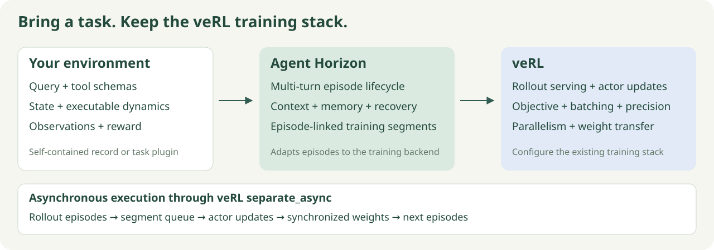

# Connect a task to Agent Horizon

A task supplies **queries, executable state transitions, tools and a reward**.
Agent Horizon supplies episode execution, context clearing, persistent memory,
training segments and the veRL integration. Your deployment supplies the model
runtime and compute resources.

Run examples from the Agent Horizon checkout after
`python -m pip install -e .`. The query-validation command below runs on CPU.
Parquet conversion uses pandas and a Parquet engine from the pinned GPU runtime;
executing isolated task tools also needs Linux with `bwrap`.



## Choose an environment implementation

| Route | Query contains | Implementation lives in | Use when |
| --- | --- | --- | --- |
| `dynamic` | Public messages/tools plus `latent_dynamics` and `tool_implementations` | The trusted query record | Each query defines its own executable world |
| Installed plugin | Public messages/tools, `environment_type` and task state | A task package | Many queries share one environment implementation |

The production loader is `long_horizon_rl.queries.load_queries`; it accepts one
record per JSONL line, or a `query` nested inside a query + rollout row. In the
nested form, outer and inner `prompt_uid` and `split` must match. Records retain
their original prompt and tool schemas.

## Record fields

| Field | Meaning | Consumed by |
| --- | --- | --- |
| `prompt_uid` | Stable query identity | Dataset and episode tracking |
| `messages` | Initial system/user messages | Model |
| `tool_schemas` | Function names, descriptions and JSON argument schemas | Model and parser |
| `environment_type` | `dynamic`, or an installed plugin name | Environment factory |
| `split` | Case-level `train` / `validation` assignment | Data preparation |
| `agent_info.max_turn` | Per-query assistant-turn limit | Episode runtime |
| `assistant_turn_limit` | Alternative turn-limit field; takes precedence | Loader |
| `python_workspace` | Enable episode-private persistent files | Shared tools |
| `python_timeout_seconds` | Default workspace Python execution budget | Shared tools |
| Task state and answer reference | Initialize transitions and grading | Trusted environment |

Only public messages, declared tools and returned observations condition the
model. Dynamics source, answer keys and trusted task state stay in the environment.
The current veRL model adapter publishes text inputs; screenshot query export
and visual replay belong to the task interface. A multimodal training adapter
must also support image observations.

## Route A: query with dynamics

Use [examples/dynamic_counter.jsonl](../../examples/dynamic_counter.jsonl) as a complete
production-loader example. It has an `advance(amount)` tool, persistent state
and an exact-target terminal reward. This is separate from `examples/counter.json`,
which describes the scripted CPU smoke fixture.

Additional fields for `dynamic`:

| Field | Contract |
| --- | --- |
| `latent_dynamics` | Python source defining `LatentDynamics` and `Env` |
| `initial_state_variable` | Passed to `Env(LatentDynamics(), initial_state_variable)` |
| `tool_implementations` | List of Python source strings defining the declared tools |
| `database` | Optional data exposed to tool implementations as `database` |
| `naive_baseline` | Terminal-state reward reference |
| `analytical_optimal` | Upper reward reference; must exceed the baseline |
| `environment_snapshot_mode` | `instance_dict` (default) or `hooks` |
| `environment_state_globals` | Additional mutable globals to include in recovery |
| `environment_rpc_max_bytes` | Maximum JSON frame size; default 16 MiB, configurable up to 64 MiB |

Tool functions use the shared `env` and `database` globals. Return an observation
object with `done: false` to continue, or `done: true` and `final_state_variable`
to finish. A terminal state can alternatively come from
`env.get_current_state_variable()`. An optional `env.next_turn()` runs after
nonterminal tool calls. Model argument errors become recoverable observations.

The included dynamic adapter computes:

```text
reward = clip((final_state_variable - naive_baseline)
              / (analytical_optimal - naive_baseline), 0, 1)
```

A nonterminal limit exit receives zero. For another reward rule, provide a plugin.
Dynamics and tools are syntax-checked during ingestion and execute in a
networkless bubblewrap worker with resource limits and RPC deadlines.
Length-prefixed frames support observations and snapshots larger than 64 KiB.
A timeout, truncated frame or protocol violation closes the worker; actions are
never automatically retried because their state may already have changed.

Validate and convert the example:

```bash
python -m long_horizon_rl.queries examples/dynamic_counter.jsonl \
  --output outputs/counter.validated.jsonl
# In the installed GPU/data runtime:
python scripts/prepare_queries.py examples/dynamic_counter.jsonl \
  --output outputs/data/counter.parquet
```

For recovery, keep mutable state in the environment instance and `database`.
Use `environment_state_globals` for other mutable globals. Objects with custom
state can choose `hooks` and implement `snapshot_state()` / `restore_state(state)`.

Workspace snapshots retain files and empty directories, with limits of 16 MiB,
128 files and 1,024 directories. Restore accepts older file-only snapshots and
stages the replacement before swapping it into place. Validation or staging
failures leave the live workspace intact; an installation failure rolls back.

## Route B: installed environment plugin

Register a factory in your task package's `pyproject.toml`:

```toml
[project.entry-points."long_horizon_rl.environments"]
my_task = "my_task.environment:MyEnvironment"
```

Then set `environment_type: "my_task"` on its queries. The factory receives the
complete trusted record. It may expose `validate_record(record)` for ingestion
checks. Core code discovers the entry point without importing task-specific modules.

### Environment lifecycle

| Method | Contract |
| --- | --- |
| `__init__(record)` | Initialize from trusted query state |
| `start()` | Prepare execution and return the environment; called by serving adapters |
| `step(action)` | Receive `{"tool": name, "arguments": {...}}`; return an observation object |
| `close()` | Release resources, including on cancellation/failure |
| `snapshot()` / `restore(state)` | Preserve task/tool state when continuation is enabled |
| `context_update()` | Optional hook when query friction is enabled |
| `finalize(reason)` | Optional scoring for turn/generation/context-limit exits |

Episode operations support synchronous or awaitable results. Serving adapters
await `start()`; implement it as an async method, as `IsolatedEnvironment` does.
A terminal observation contains `done: true` and a finite scalar `reward`.
A plugin defines its reward directly. Optional `score` diagnostics populate episode terminal metrics. Return only public
information in nonterminal observations, which become the next model input.

```python
async def step(self, action):
    # Validate arguments, update task state, then return public observations.
    return {"done": False, "observations": ["The door is now open."]}

async def finalize(self, reason):
    return {"done": True, "reward": self.grade_current_state()}
```

Snapshots must cover all state needed to continue the episode. Memory and training
segments are managed by the episode runtime; context clears retain the task state.
Recoverable model errors should return `error` with `done: false`. Worker exits,
transport errors and uncertain RPC deadlines must remain infrastructure failures.

## Reuse shared tools

| Component | Public API |
| --- | --- |
| Persistent files | `long_horizon_rl.python_workspace.PythonWorkspace` |
| Isolated Python | `long_horizon_rl.python_tool.PythonTool`, `run_python` |
| Memory and notes | `long_horizon_rl.memory.operate`, `operate_notes`, `NotesStore` |
| Clear/warning notices | `long_horizon_rl.context_feedback` |
| Isolated environment RPC | `long_horizon_rl.sandbox.IsolatedEnvironment` |

Subclass `PythonTool` to select a task runtime through `runtime_path()` or a
memory limit through `memory_bytes`. Reuse the workspace and note implementations
directly. Declare the corresponding tools in the query schema when exposing them
to the model. `LONG_HORIZON_TOOL_RUNTIME` is an environment **directory**, containing
`bin/python`; deployment-specific read-only mounts use `LONG_HORIZON_SANDBOX_BINDS`.

## Concrete example: Murdoku

[Murdoku Lab](https://github.com/EverywhereSafety/murdoku-lab) stores its board,
clues, theme and answer reference in each query. Its installed `murdoku` plugin
uses a shared puzzle environment instead of embedding Python dynamics in every
record. `murdoku_case` initializes the trusted puzzle state;
`murdoku_theme` supplies its semantic presentation.

| Public contract | Murdoku implementation |
| --- | --- |
| Initial query and tools | `murdoku_lab/environment/queries.py`, `murdoku_lab/environment/protocol.py` in Murdoku Lab |
| State transitions | `murdoku_lab/environment/state.py`, `murdoku_lab/environment/actions.py` |
| Gold reward | `murdoku_lab/environment/scoring.py`, `murdoku_lab/environment/rewards.py` |
| Text / screenshot observations | `murdoku_lab/core/render.py`, `murdoku_lab/environment/vision.py`, `murdoku_lab/visual/art.py` |
| Fresh rollout replay | `murdoku_lab/environment/replay.py` |
| Training environment bridge | `examples/murdoku/murdoku_demo/murdoku.py` on the demo branch |

Follow [Murdoku integration](https://github.com/EverywhereSafety/murdoku-lab/blob/main/docs/guides/rl.md)
for export, plugin setup and training commands. Task rules, rendering and replay
stay in Murdoku Lab; shared tools and training execution stay in Agent Horizon.

Unified query + rollout records may omit the outer `split`; the split on
`query` is then used. An explicit outer split or query identity must agree with
the query. Loading a record does not rewrite the source dataset.
