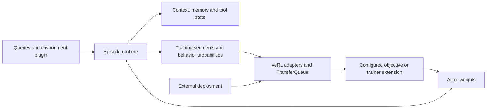

# Architecture

Agent Horizon provides episode execution and training integration for stateful,
long-horizon agents on veRL.

Environment plugins provide task state, tools and rewards. The optional Murdoku
package on `refactor/murdoku-demo` connects Murdoku Lab to this interface and adds
collection, evaluation and training-data utilities.

Trainer plugins provide custom objectives through an independent package entry
point. [Trainer extensions](trainer-plugins.md) describes registration and async
checkpoint integration.

Deployment supplies GPU resources, runtime paths, model caches and scheduling.
Environment records keep model-facing messages separate from trusted grader
fields.

## Runtime layers



The environment owns task state, observations and reward. The episode runtime
owns interaction order, context transitions and sampled trajectories. The backend
adapter owns distributed generation, actor updates, transfer and checkpoint
integration. An algorithm extension owns its objective; a deployment chooses
resources, paths and scheduling.

## Find the code

| Concern | Modules |
|---|---|
| Environment and record interfaces | `contracts.py`, `queries.py`, `environments/` |
| Episode and persistent memory | `episode.py`, `groups.py`, `memory.py`, `context_feedback.py` |
| Tools and isolation | `parser.py`, `python_workspace.py`, `python_tool.py`, `sandbox.py`, worker modules |
| Trajectory accounting | `trajectory_weighting.py`, `group_config.py`, `group_selection.py`, `episode_metrics.py` |
| veRL serving/training | `adapters/verl_v1.py`, `adapters/trainer_v1.py`, `train.py` |
| OPD | `adapters/opd_v1.py`, `adapters/opd_scoring.py`, `adapters/opd_padding.py` |
| Async and transport | `transport.py`, `async_profile.py`, `adapters/separate_lifecycle.py` |
| Recovery and retention | `continuation.py`, `replay.py`, `checkpoint_retention.py`, `adapters/checkpoint_v1.py` |
| Custom algorithms | `trainer_plugins.py`; implementations in independent packages |
| Diagnostics | `agent_preflight.py`, `diagnostics/` and `scripts/checks/` |

Paths in the table are relative to `long_horizon_rl/`. Shared runtime modules keep stable import paths in this package; diagnostics
live in `diagnostics/`; backend-specific code lives under
`adapters/`, and environments register independently under `environments/`.

## Backend compatibility

The core episode and environment contracts are model-independent. The current
veRL adapter uses `QwenTokenizer` for ChatML tool-response framing and thinking
prefixes, and publishes text-only inputs. Additional model chat templates and
multimodal training belong in backend adapters; the Murdoku visual data interface
is separate from this text-training adapter. Runtime pins identify the supported
backend revision because the adapters extend veRL V1 internals.

## Repository entry points

- `configs/`: training and pinned runtime profiles.
- `configs/backends/`: optional backend dependency pins.
- `scripts/checks/`: adapter contracts and rollout audits.
- `scripts/backends/`: optional backend environment preparation.
- `scripts/launch_train.sh`: shared runtime launch defaults.
- `scripts/train_long_horizon.sh`: GRPO launch profile.
- `scripts/train_opd.sh`: distillation launcher.
- `python examples/smoke.py`: dependency-free CPU walkthrough.
- `examples/counter.json`: generic fixture.
- `tests/`: contract, lifecycle and adapter checks.
- `docs/`: setup and component contracts.
- `requirements/`: locked isolated-tool dependencies.
- `examples/deployment/`: optional Ray cluster setup, separate from training.
- `examples/murdoku/` on the demo branch: task bridge and collection/SFT utilities.

Changing context must preserve the training record of earlier actions. Async
admission must account for dispatch policy versions. Recovery must restore a
consistent episode/queue boundary. These are framework contracts, independent
of a puzzle, objective or GPU cluster.

## Shared task tools

`PythonWorkspace`, `PythonTool`, note persistence and context notices are CPU-only
components. Task packages can reuse them directly and subclass `PythonTool` to
select a runtime. Murdoku Lab owns its prompt, text/vision observation profiles
and fresh replay; the demo imports them rather than maintaining another protocol.

## Development

Use Python 3.10+ for the pinned Black formatter; the CPU core supports Python 3.9+.

```bash
python -m pip install -e ".[dev,test]"
python -m black --check .
python -m pytest
```

The scripted CPU walkthrough and its fixtures live in `examples/smoke.py`.
